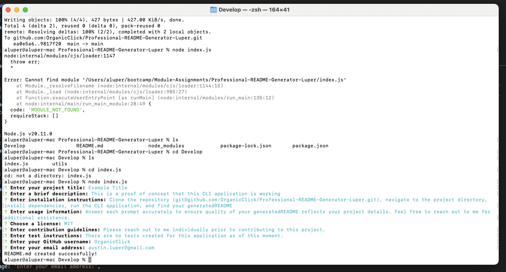

# Professional-README-Generator-Luper

The following README.md file will be used to outline the purpose for this project, user story, acceptance criteria,
and other relevant content to satisfy the requirements for this assignment.

BOTTOM-LINE: This project seeks to create a command-line interface application that dynamically generates a professional
README.md file from a user's input using the Inquirer package.

VIDEO OF INTENDED USER FLOW:
(IMPORT VIDEO HERE)

SCREENSHOTS:

USER STORY:
AS A developer
I WANT a README generator
SO THAT I can quickly create a professional README for a new project

ACCEPTANCE CRITERIA:
GIVEN a command-line application that accepts user input
WHEN I am prompted for information about my application repository
THEN a high-quality, professional README.md is generated with the title of my project and sections entitled Description, Table of Contents, Installation, Usage, License, Contributing, Tests, and Questions
WHEN I enter my project title
THEN this is displayed as the title of the README
WHEN I enter a description, installation instructions, usage information, contribution guidelines, and test instructions
THEN this information is added to the sections of the README entitled Description, Installation, Usage, Contributing, and Tests
WHEN I choose a license for my application from a list of options
THEN a badge for that license is added near the top of the README and a notice is added to the section of the README entitled License that explains which license the application is covered under
WHEN I enter my GitHub username
THEN this is added to the section of the README entitled Questions, with a link to my GitHub profile
WHEN I enter my email address
THEN this is added to the section of the README entitled Questions, with instructions on how to reach me with additional questions
WHEN I click on the links in the Table of Contents
THEN I am taken to the corresponding section of the README

REFERENCES:
Source for understanding npm-init setup:
	https://docs.npmjs.com/cli/v10/commands/npm-init
	https://stackoverflow.com/questions/40785808/npm-init-what-on-earth-are-the-questions-asking
	https://nodesource.com/blog/the-basics-getting-started-with-npm/

Setting up gitignore file:
	https://docs.github.com/en/get-started/getting-started-with-git/ignoring-files
	https://www.freecodecamp.org/news/gitignore-what-is-it-and-how-to-add-to-repo/

Attempting to exclude node_modules:
	https://blogboard.io/blog/knowledge/git-ignore-node-modules/

Reference for creating a Professional README:
	https://coding-boot-camp.github.io/full-stack/github/professional-readme-guide

Source of cloned Starter code for this project:
	https://github.com/coding-boot-camp/potential-enigma

Cloned Github SSH URL (Starter code):
	git@github.com:coding-boot-camp/potential-enigma.git

Source for inquirer package installed:
	https://www.npmjs.com/package/inquirer/v/8.2.4

Reference for use of arrow functions in JavaScript:
	https://www.w3schools.com/js/js_arrow_function.asp

Reference for use of async functions in JavaScript:
	https://www.w3schools.com/js/js_async.asp

Referenced for examples of index.js syntax/structure of user prompt questions:
	https://dev.to/ghostaram/build-a-cli-based-project-generator-with-node-56ld

Resource for using node file system (fs):
	https://www.w3schools.com/nodejs/nodejs_filesystem.asp

Also sourced lecture notes from GWU Coding Bootcamp (GitLab 10-OOP/01-Activities) for structure and syntax examples 
that I referenced for creation of this project.

Referenced for creation of a function to initialize app (syntax):
	https://stackoverflow.com/questions/40390468/how-to-run-node-js-module-initialization-properly

Referenced for use of “try” and “catch” and “throw”:
	https://www.w3schools.com/js/js_errors.asp

Reference for using fs.writeFileSync():
	https://www.geeksforgeeks.org/node-js-fs-writefilesync-method/#